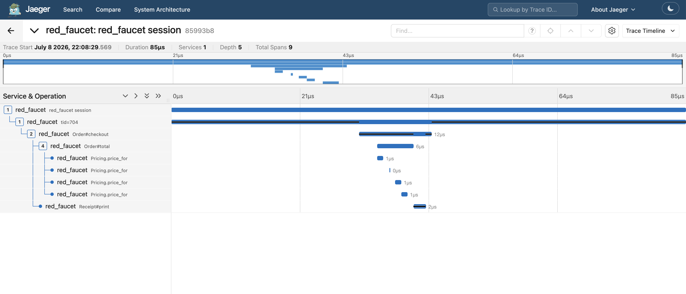

# OrangeTap

OrangeTap hooks Ruby method calls (call/return) with `TracePoint`, assembles
them into OpenTelemetry-style spans on a background thread inside the same
process, and writes the result as an OTLP/JSON file. There is no central
daemon, no shared memory, and no inter-process communication of any kind —
tracing is entirely contained within the observed Ruby process.

## Design notes

### Why Ruby-level `TracePoint` instead of `rb_add_event_hook`

OrangeTap intentionally uses the Ruby-level `TracePoint` API rather than the
C-level `rb_add_event_hook`/`trace_func` mechanism. Ruby 4.0's C-level
`trace_func` has a known bug, so this gem avoids it by design and pays the
(small, and in practice dominated by the traced call itself) overhead of a
Ruby-level hook instead. Target methods are narrowed with
`TracePoint#enable(target: iseq)` so untargeted methods incur no hook
overhead at all.

### No central daemon — everything lives in one process's Thread + Queue

Earlier iterations of this idea used a shared-memory ring buffer and an XPC
daemon process. OrangeTap drops all of that: a session is just a
`Thread::Queue` plus a background `Thread` inside the same process that
called `OrangeTap.open`. Correlating traces across multiple OS processes is
explicitly out of scope for this gem.

### Why `open`/`stop` need no `session_id`

Each call to `open` creates a brand new `Queue` and worker `Thread` dedicated
to that session. Because a Worker only ever drains events pushed by the
TracePoints that same `Session` enabled, the `Queue` instance itself is what
scopes an event to a session — there is no `session_id` field anywhere, and
running multiple sessions concurrently (multiple `OrangeTap.new.open` calls
at once) works without any extra bookkeeping.

### What isn't tracked

- **Cross-thread/Fiber/Ractor causality.** Spans are grouped strictly by
  `thread_id`, so if a traced method spawns work on another thread
  (`Thread.new`, a Fiber, a Ractor), that work's spans are not linked back to
  the caller as parent/child. This is out of scope for the current version.
- **Methods defined via `define_method` or a block.** `trace_method` requires
  a `Method`/`UnboundMethod` backed by a `def`-defined instance sequence.
  Block-based method bodies (`define_method`, `define_singleton_method`) have
  an ISeq of type `:block`, which `TracePoint#enable(target:)` cannot target
  and raises `ArgumentError` — attempting to trace one will fail at `open`
  time, not at `trace_method` time. (The
  [trace-all-application-methods mode](#tracing-all-application-methods-opt-in)
  captures these, since it uses a global hook rather than a per-ISeq target.)
- **C-implemented methods, unless explicitly opted in.** Methods with no Ruby
  ISeq are rejected by default. They can be traced via a global hook by
  setting `config.trace_c_methods = true`, at a process-wide performance cost
  — see [Tracing C-implemented methods](#tracing-c-implemented-methods-opt-in).
- **Errors inside the Worker thread.** If the worker thread raises while
  assembling spans, `Session#stop` re-raises that error via `Thread#value`'s
  standard behavior. TracePoints are always disabled *before* the worker is
  waited on, so a worker crash never leaves hooks enabled.
- **Double-hook overhead across concurrent sessions.** If two sessions are
  open at once and both target the same method, that method gets two
  independent `TracePoint`s enabled on it. This is accepted for simplicity in
  the current version.

## Installation

```bash
bundle add orange_tap
```

Or, without Bundler:

```bash
gem install orange_tap
```

## Usage

```ruby
require "orange_tap"

class Worker
  def process(job)
    # ...
  end
end

OrangeTap.trace_method(Worker.instance_method(:process))

path = OrangeTap.open do
  Worker.new.process(job)
end
# => path to a written OTLP/JSON file
```

Or using the instance form:

```ruby
tape = OrangeTap.new
tape.open
# ...
path = tape.stop
```

The root (session) span is named `"orange_tap session"` by default. Pass a
name to override it — handy for telling sessions apart when the output is
imported into a trace viewer:

```ruby
OrangeTap.open("checkout-flow") { ... }

tape = OrangeTap.new
tape.open("checkout-flow")
# ...
tape.stop
```

Other registration entry points:

```ruby
OrangeTap.trace_method(SomeClass.method(:some_class_method))   # class/singleton method
OrangeTap.trace_method(some_object.method(:some_method))       # singleton method on one object
OrangeTap.trace_all_instance_methods(SomeClass)                # all instance methods at once
OrangeTap.untrace_method(SomeClass.instance_method(:some_method))

# Register several methods in one call, and/or use "Foo.bar" / "Foo#bar"
# notation strings instead of resolving Method/UnboundMethod objects yourself:
OrangeTap.trace_method("SomeClass.some_class_method", "SomeClass#some_method")
OrangeTap.untrace_method("SomeClass.some_class_method", "SomeClass#some_method")
```

Output location is configurable:

```ruby
OrangeTap.config.output_dir = "/path/to/traces"
```

### Tracing all application methods (opt-in)

Instead of registering methods one by one, you can trace **every non-builtin
Ruby method call** in the process by enabling a single flag before opening a
session:

```ruby
OrangeTap.config.trace_all_app_methods = true

OrangeTap.open("request") do
  # every application (and gem) method called here is captured automatically
  MyApp.handle(request)
end
```

In this mode a session installs one global `:call`/`:return` `TracePoint` (no
`target:`) and decides what to keep by the **definition path** of each called
method:

- **Excluded:** Ruby core internals (`<internal:...>`) and the standard library
  (under Ruby's `rubylibdir`/`rubyarchdir`), plus OrangeTap's own code.
- **Excluded automatically:** all C-implemented methods (`String#upcase`,
  `Array#each`, `Integer#+`, …) — `TracePoint(:call)` never fires for them.
- **Traced:** everything else, i.e. your application code **and gems**.

Because it needs no ISeq target, this mode also captures methods defined via
`define_method` / `define_singleton_method`, which the per-method
`trace_method` API cannot target.

When enabled, this mode **supersedes** explicit `trace_method` registration:
per-method (and C-method opt-in) hooks are not installed for that session.

> **Performance warning:** the hook fires on **every Ruby method call in the
> process**, running a (memoized) path check each time. This is the heaviest
> mode OrangeTap offers — use it for focused debugging sessions, not always-on
> production tracing. Concurrent sessions each add their own global hook.

### Tracing C-implemented methods (opt-in)

By default, registering a C-implemented method (one with no Ruby ISeq, e.g.
`String#upcase`) raises `OrangeTap::UntraceableMethodError`, because the
low-overhead `TracePoint#enable(target:)` mechanism requires an ISeq.

You can opt in to tracing C methods through the same `trace_method` API by
enabling a config flag **before** registering them:

```ruby
OrangeTap.config.trace_c_methods = true
OrangeTap.trace_method(String.instance_method(:upcase))   # now accepted
```

**Performance trade-off:** when enabled and at least one C method is
registered, each session installs a single global `:c_call`/`:c_return`
`TracePoint` (no `target:`). That hook fires on **every C call in the
process** — including very hot ones like `Array#each`, `Hash#[]`, `Integer#+`
— and filters by `[owner, name]` inside the hook. So the "zero overhead for
unregistered methods" guarantee no longer holds once any C method is traced.
Concurrent sessions each add their own global hook, compounding the cost.
Enable it only when you specifically need C-method spans.

A C method that is a *singleton method on a specific object* (rather than a
class/singleton method like `Foo.bar`) is not supported: it is skipped with a
warning at registration time.

### Example

[`examples/order_demo.rb`](examples/order_demo.rb) is a runnable,
self-contained example. It defines a small `Order`/`Pricing`/`Receipt` set of
classes:

```ruby
class Order
  def total
    @items.sum { |item| Pricing.price_for(item) }
  end

  def checkout
    amount = total
    Receipt.new(amount).print
    amount
  end
end

module Pricing
  def self.price_for(item) = PRICES.fetch(item, 0)
end

class Receipt
  def print = puts "Total: #{@amount} yen"
end
```

traces a mix of instance and module methods, and wraps the call in
`OrangeTap.open`:

```ruby
OrangeTap.trace_method(
  "Order#total",
  "Order#checkout",
  "Pricing.price_for",
  "Receipt#print"
)

path = OrangeTap.open do
  Order.new(%w[coffee cake tea coffee]).checkout
end
```

Run it with:

```bash
bundle exec ruby -Ilib examples/order_demo.rb
```

This prints the OTLP/JSON file path and pretty-prints its contents. A sample
of that output is checked in at
[`examples/trace-example.json`](examples/trace-example.json).

Importing that JSON into Jaeger (all-in-one) as an OTLP trace renders the
following span tree, which matches the example's call graph exactly —
`orange_tap session` → `tid=...` → `Order#checkout` → `Order#total` →
`Pricing.price_for` ×4, plus `Receipt#print`:



## Development

After checking out the repo, run `bin/setup` to install dependencies. Then,
run `rake test` to run the tests. You can also run `bin/console` for an
interactive prompt that will allow you to experiment.

## Contributing

Bug reports and pull requests are welcome on GitHub at
https://github.com/udzura/orange_tap. This project is intended to be a safe,
welcoming space for collaboration, and contributors are expected to adhere to
the [code of conduct](https://github.com/udzura/orange_tap/blob/main/CODE_OF_CONDUCT.md).

## Code of Conduct

Everyone interacting in the OrangeTap project's codebases, issue trackers,
chat rooms and mailing lists is expected to follow the
[code of conduct](https://github.com/udzura/orange_tap/blob/main/CODE_OF_CONDUCT.md).
